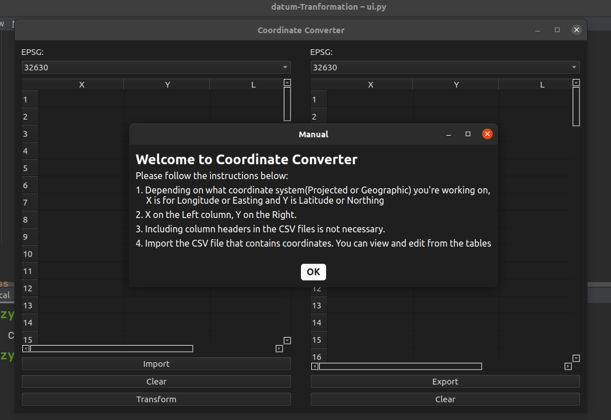
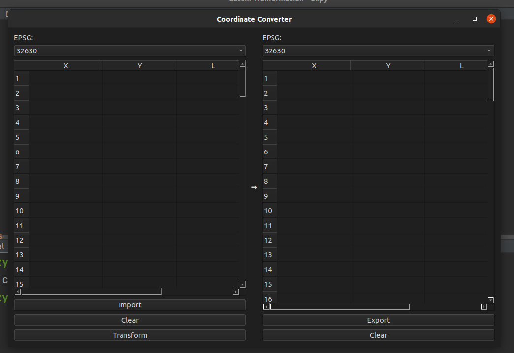
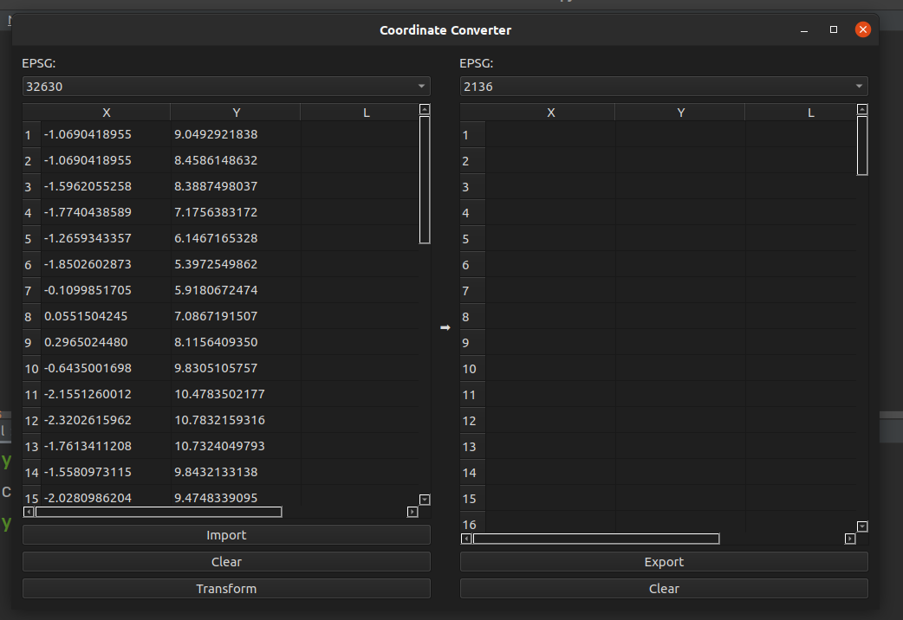
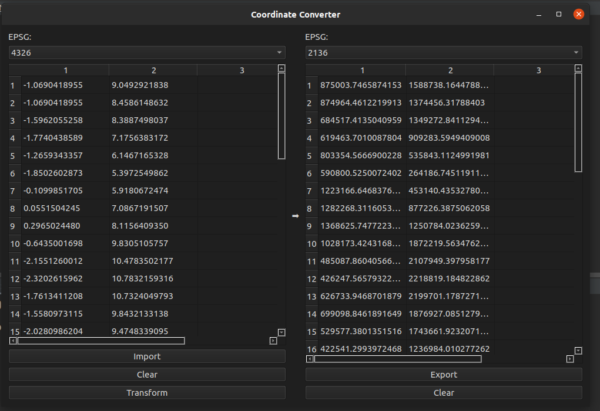

## Datum transformation desktop app in Python
Datum transformation GUI in python
#### Dowload app over here - [D-converter](https://drive.google.com/file/d/14k3O5u54prEA36rBbre1kcu85TM51TSs/view?usp=sharing)

### Datum Transformation Screenshots

This guide demonstrates how to perform datum transformation using the Coordinate Converter application.

## Step 1: Opening the Application

When you start the application, you will see the instruction screen as shown below:

## Step 2: Main Interface

Here is the main interface where you can import your CSV files and start transforming coordinates:

## Step 3: Input
Here, the input data is loaded on the left. Choose crs of data and destination crs.

## Step 3: Input and Output

This is how the input data looks on the left, and after the transformation, the output data is displayed on the right:

## Lastly

You can go ahead and download the results

### Tools 
- PyQt5==5.15.4
- geopandas==0.9.0
- pandas==1.3.3
- shapely==1.7.1
